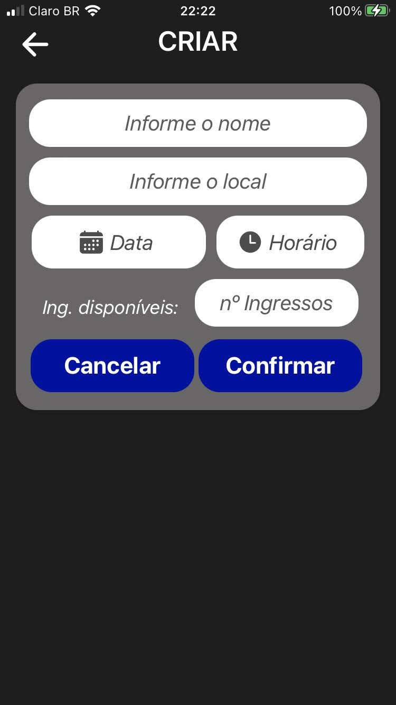
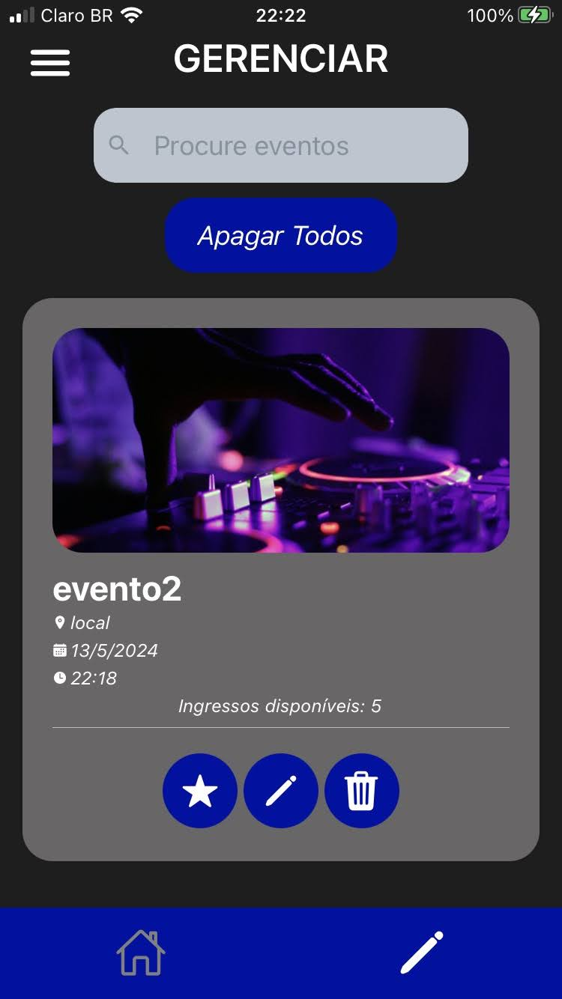
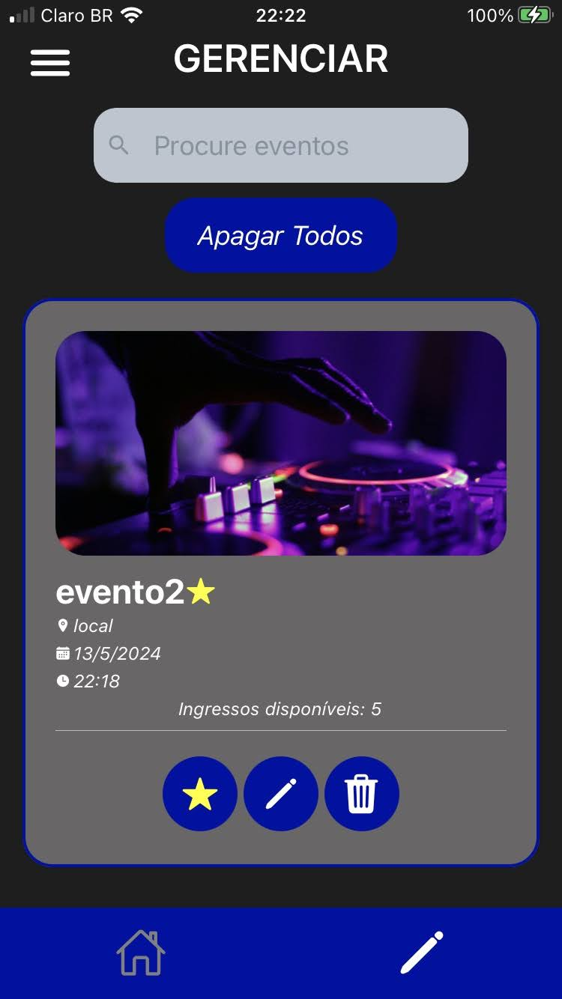
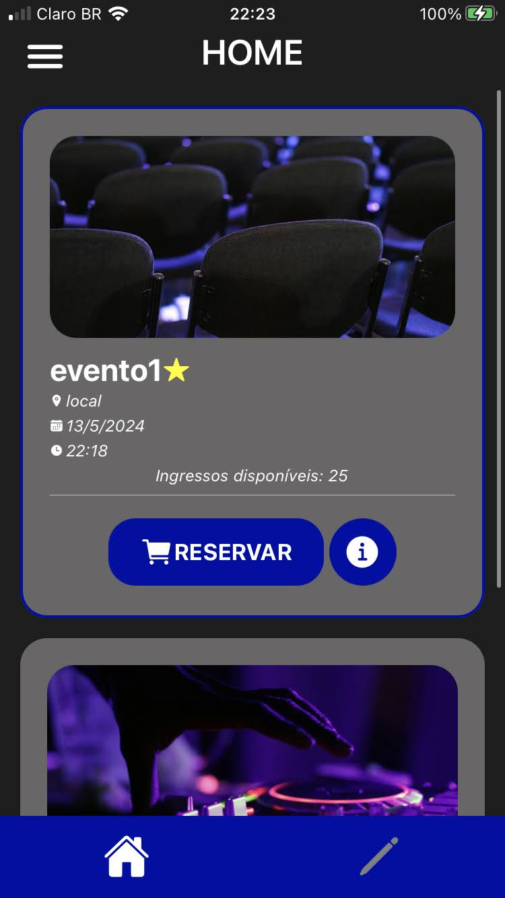
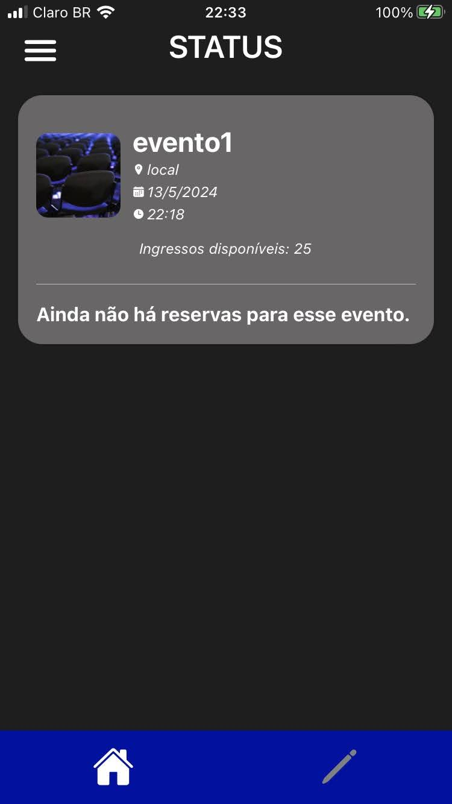
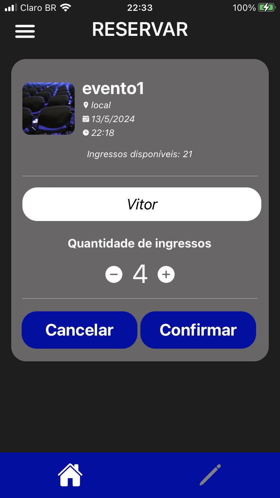
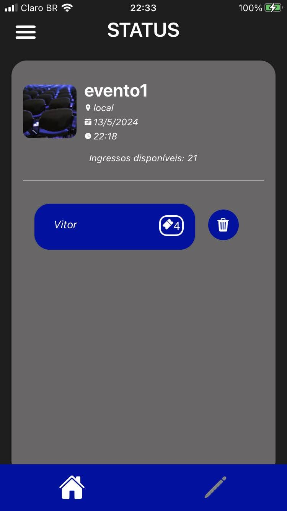

# Tickets App

Projeto desenvolvido durante a disciplina de Tópicos de Programação em Novas Tecnologias, parte da estrutura curricular de Ciência da Computação na UNESP.

## Objetivo

O objetivo do app é cadastrar, visualizar, editar e excluir eventos. Além de também ser possível "comprar" ingressos, informando nome e quantidade de ingressos para determinado evento.

O armazenamento dos dados foi feito utilizando AsyncStorage

## Telas

